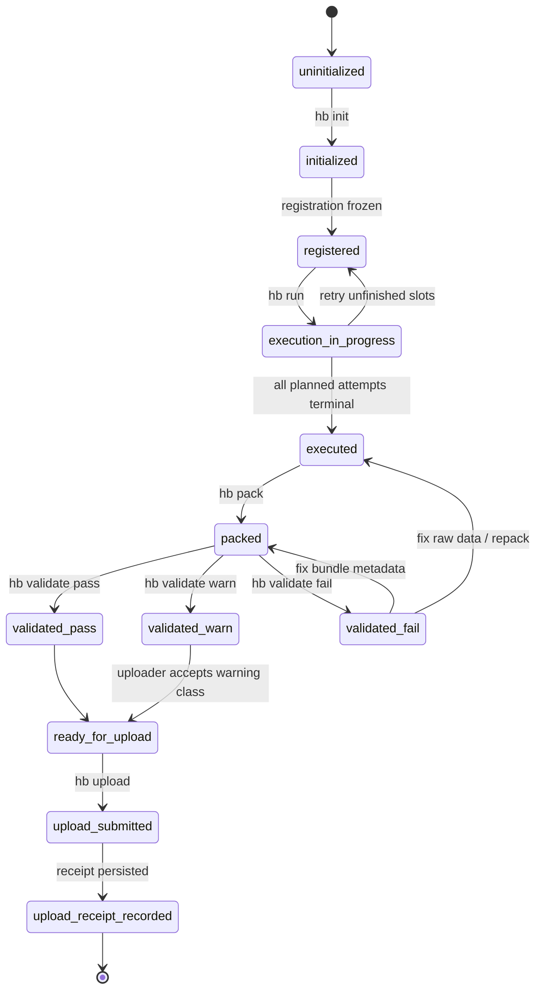

# OHBP v0.1 CLI / Validator / Verifier MVP 架构设计（D2）

## 0. 文档定位

本文只回答一个问题：

> 如何从已经冻结的 `OHBP v0.1` 协议出发，先做出 **能跑通本地执行→打包→本地校验→上传→平台复验** 的最小实现闭环。

本文**不改协议**，只做实现阶段的 MVP 工作流设计。

约束来自：

- `E:/工作区/10_Projects_项目/harness测评网站/docs/ohbp-v0.1/ohbp-v0.1.md`
- `E:/工作区/10_Projects_项目/harness测评网站/task_plan.md`

---

## 1. 设计结论先行

1. **MVP 的真正主线不是“做全命令”，而是先把 `init -> run -> pack -> validate -> inspect -> upload(dry-run/mock)` 打通。**
2. **validator 与 verifier 必须分层：validator 只做本地确定性校验，verifier 才能授予 `trust_tier / publication_state / autonomy_mode`。**
3. **`pack` 是 raw workspace 与 canonical bundle 的唯一归一化边界，所有高信任语义都必须在 bundle 上被验证，而不是在 raw 工作目录上直接判断。**
4. **第一阶段上传与平台复验可以先用 mock endpoint / sample bundle / sample verification record 打通，不必一开始就做完整后端。**
5. **实现栈建议用 TypeScript monorepo：schema 包 + validator 引擎 + CLI + mock verifier + Web 前端共享类型，确保协议对象只有一套真源。**

---

## 2. MVP 范围切分

### 2.1 目标闭环

MVP 必须做到的不是“所有命令都能用”，而是下面这条闭环真实可运行：

```text
用户定义 study
  -> 生成 benchmark / lane / adapter 配置
  -> 执行一次或一组 attempts
  -> 产出 raw workspace
  -> pack 成 canonical final bundle
  -> 本地 validate bundle
  -> inspect bundle / 研究视图原型
  -> 上传到 mock intake
  -> mock verifier 产出 completeness / verification / scorecard 派生物
```

### 2.2 MVP 外的内容

这些内容应明确延后：

- 完整 reproduce marketplace
- 多租户鉴权
- 真正的分布式任务调度
- 完整的官方受控 runner
- 全量榜单算法与在线 dispute 流程
- 大规模 sealed evidence 托管

---

## 3. CLI 命令集合的 MVP 切分

## 3.1 建议命令族

协议里已有命令族：

- `doctor`
- `init`
- `run`
- `pack`
- `upload`
- `replay`
- `reproduce`
- `inspect`
- `preset list`
- `adapter init`
- `adapter validate`

实现阶段建议新增一个**明确的本地 bundle 检查命令**：

- `validate`

原因：

- 协议里虽然把校验责任写得很清楚，但若没有独立的 `validate` 命令，用户会把 `pack` 当作“已经有效”
- `pack` 的职责应是**归一化产物**
- `validate` 的职责应是**判定归一化产物是否符合协议**

### 3.2 命令优先级分层

| 命令 | MVP 优先级 | 是否立即实现 | 说明 |
|---|---|---:|---|
| `hb doctor` | P0 | 是 | 环境/依赖/目录/Node 版本/adapter 可执行性预检 |
| `hb init` | P0 | 是 | 初始化 study、adapter 配置、submission profile、run-group registration 草稿 |
| `hb run` | P0 | 是 | 执行 raw attempts，写入 `.hb/runs/...` |
| `hb pack` | P0 | 是 | 将 raw workspace 归一化为 canonical final bundle |
| `hb validate` | P0 | 是 | schema / digest / 引用一致性 / evidence 完整性本地校验 |
| `hb inspect` | P0 | 是 | 本地查看 bundle、summary、错误、研究视图摘要 |
| `hb upload` | P1 | 是，但先做 mock / dry-run | 先打通 intake 协议，不先做正式平台 |
| `hb preset list` | P1 | 是 | 便于试用与 onboarding |
| `hb adapter init` | P1 | 是 | 生成 custom adapter 模板 |
| `hb adapter validate` | P1 | 是 | 对 adapter 原始合同做预检 |
| `hb replay` | P2 | 先 stub | 先输出 “not yet implemented + required artifacts” |
| `hb reproduce` | P2 | 先 stub | 先面向 verifier mock 输出占位工作流 |

### 3.3 推荐的 MVP 命令最小集

第一阶段真实交付建议只承诺：

```bash
hb doctor
hb init
hb run
hb pack
hb validate
hb inspect
hb upload --dry-run
hb upload --endpoint <mock>
hb preset list
hb adapter init
hb adapter validate
```

### 3.4 各命令的最小职责

#### `hb doctor`

最小职责：

- 检查 Node / CLI 版本
- 检查当前目录是否已初始化 `.hb/`
- 检查 adapter launcher 是否存在
- 检查 benchmark manifest / execution contract / task package 引用是否可解析
- 输出阻断项与警告项

不做：

- 不授予信任等级
- 不尝试修复数据语义问题

#### `hb init`

最小职责：

- 初始化 `.hb/`
- 生成 `study.json`
- 生成 `run-group-registration.json` 草稿或正式版
- 固化 `submission_profile`
- 解析 preset 或 custom adapter
- 生成本次 study 的配置快照

建议支持：

- `hb init --preset terminal-lite-v1`
- `hb init --adapter ./adapter.yaml`
- `hb init --profile reproducible_standard`

#### `hb run`

最小职责：

- 根据 registration 生成 attempts
- 向 adapter 注入 OHBP 环境变量
- 收集 raw outputs：
  - `result.json`
  - `trace.jsonl`
  - `stdout.log`
  - `stderr.log`
  - `artifacts/`
- 生成 `run-metadata.json`
- 保留执行失败 attempt，不允许只保留成功 attempt

关键原则：

- `run` 只产出 raw workspace
- `run` 不直接声称“可上传”或“可比较”

#### `hb pack`

最小职责：

- 从 raw workspace 读取 run-group / attempt outputs
- 生成 canonical final bundle layout
- 计算 digest / checksums
- 生成 `manifest.json`
- 绑定 registration / tolerance / evidence refs

关键原则：

- `pack` 是唯一 canonicalization 阶段
- raw workspace 与 final bundle 之间必须可追踪但不可混同

#### `hb validate`

最小职责：

- schema 校验
- canonical refs 校验
- digest / checksums 校验
- evidence channel 规则校验
- interaction / autonomy 前置完备性校验
- registration / manifest / verification 前置引用校验（若存在对应对象）

输出：

- `PASS / WARN / FAIL`
- 错误代码
- 机器可读报告 `validation-report.json`

#### `hb inspect`

最小职责：

- 人类可读查看 bundle 元数据
- 查看 manifest / registration / evidence 摘要
- 查看 task coverage / attempt coverage
- 查看为什么不能上传或不能进入更高 trust tier

建议两种模式：

- `scorecard` 风格摘要
- `research` 风格对象追踪

#### `hb upload`

MVP 最小职责：

- `--dry-run`：生成拟上传 payload，不联网
- `--endpoint`：上传到 mock intake
- 接收 receipt
- 把 receipt 保存到本地 `.hb/uploads/`

暂不做：

- 复杂鉴权体系
- 多种证据仓库存储后端

---

## 4. 本地执行流状态机：init / run / pack / validate / inspect / upload

## 4.1 核心设计

协议已冻结 CLI 生命周期：

```text
initialized -> executed -> packed -> uploaded
```

但实现层为了提升可恢复性，建议把内部状态细化为：

```text
uninitialized
  -> initialized
  -> registered
  -> execution_in_progress
  -> executed
  -> packed
  -> validated_pass / validated_warn / validated_fail
  -> ready_for_upload
  -> upload_submitted
  -> upload_receipt_recorded
```

其中：

- `validated_*` 是**本地工程状态**
- `published / verified / reproduced` 仍然**绝不能**出现在本地 lifecycle 里

## 4.2 推荐状态机



## 4.3 状态与目录映射

建议本地目录如下：

```text
.hb/
  study.json
  registrations/
    run-group-registration.json
  runs/
    run_<id>/
      run-metadata.json
      adapter-resolution.json
      tasks/
        <task_id>/
          result.json
          trace.jsonl
          stdout.log
          stderr.log
          artifacts/
  bundles/
    <bundle_id>/
      manifest.json
      checksums.sha256
      reports/
      traces/
      payloads/
  validation/
    <bundle_id>.validation-report.json
  uploads/
    <bundle_id>.upload-request.json
    <bundle_id>.upload-receipt.json
```

## 4.4 各阶段输入/输出边界

| 阶段 | 输入 | 输出 | 可否重跑 |
|---|---|---|---|
| `init` | preset / adapter / profile / benchmark refs | `study.json`、registration 草稿 | 可以 |
| `run` | registration + adapter + benchmark objects | raw workspace | 可以，但必须记录 slot/attempt 关系 |
| `pack` | raw workspace + registration + contract refs | canonical final bundle | 可以 |
| `validate` | final bundle | validation report | 可以 |
| `inspect` | final bundle / validation report | 人类可读摘要 | 可以 |
| `upload` | final bundle + validation status | upload request / receipt | 可以，但必须生成新 receipt |

## 4.5 恢复与幂等原则

### `init`

- 同 study 重跑时默认要求显式 `--force`

### `run`

- 必须允许只重跑缺失 slots
- 不允许无痕覆盖已存在 attempt
- 如果 replacement policy 不允许，则 replacement 必须失败

### `pack`

- 若 raw workspace 没变，重复 `pack` 必须产出相同 digest
- 若用户修改了 raw 数据，必须显式记录 bundle digest 变化

### `validate`

- 必须纯函数化：同 bundle 输入得到同报告

### `upload`

- receipt 是 append-only，本地不得覆盖旧 receipt

---

## 5. Validator 与 Verifier 的职责边界

## 5.1 一句话边界

> **validator 判断“这个 bundle 是否协议合格”；verifier 判断“这个 bundle 是否足以被平台授予某种治理结论”。**

## 5.2 Validator 的职责

validator 是**本地/离线/确定性**组件，核心目标是：

- 帮用户在上传前发现结构错误
- 帮平台 intake 复用一套规则
- 不越权做治理裁决

validator 应负责：

1. **schema 校验**
   - manifest
   - registration
   - completeness-proof（如存在）
   - interaction-summary
   - verification-record（如用于复查）

2. **bundle layout 校验**
   - 必需文件是否存在
   - 路径是否符合 canonical layout

3. **digest / checksum 校验**
   - `checksums.sha256`
   - manifest 中各 digest/ref 可追溯

4. **cross-object consistency 校验**
   - `manifest.registration_ref`
   - `manifest.tolerance_policy_ref`
   - `public_bundle_digest`
   - `sealed_audit_bundle_digest`

5. **evidence completeness 前置检查**
   - `interaction-log.jsonl` / `interaction-summary.json`
   - `trace_root_hash`
   - `artifact-manifest`
   - `network_proxy_log_digest`（如适用）

6. **autonomy 前置资格检查**
   - 能检查“是否缺少判定必需字段”
   - 不能最终裁定 `autonomous / approval_only / interactive`

7. **upload readiness 检查**
   - 是否满足某 profile 的最小上传负担

validator 不应负责：

- 不计算 `trust_tier`
- 不计算 `publication_state`
- 不做完整平台 policy 裁决
- 不生成官方 `verification_record`
- 不把自报结果升级成 `verified`

## 5.3 Verifier 的职责

verifier 是**平台/治理/裁决**组件，应负责：

1. **intake receipt 与 ingestion**
2. **completeness proof 生成**
3. **repeatability / registration controls 审计**
4. **autonomy mode 裁决**
5. **evidence channel / redaction / release policy 合规审计**
6. **replay / reproduce / official rerun 结果接入**
7. **trust tier 裁定**
8. **publication state 决策**
9. **verification record 生成**
10. **scorecard / research view 派生**

## 5.4 最佳边界模型

建议把校验链拆成三层：

```text
Layer 1: Schema Validator
  -> 文件结构/字段类型/枚举/必填项

Layer 2: Bundle Integrity Validator
  -> digest / ref / cross-object / layout / artifact 完整性

Layer 3: Platform Verifier
  -> completeness / tolerance / autonomy / trust tier / publication state / ranking eligibility
```

这样做的好处：

- 本地 CLI 与平台 intake 共用 Layer 1/2
- 平台专有治理能力留在 Layer 3
- 不会让 CLI 越权“冒充平台裁决器”

---

## 6. 哪些命令适合立即实现，哪些应以 mock / sample data 先打通

## 6.1 立即实现（真实可用）

以下命令应立即做成真实可用：

### A. `hb init`

原因：

- 没有 init，就没有 study / registration 入口

### B. `hb run`

原因：

- 需要真实生成 raw workspace，不能只靠样例

### C. `hb pack`

原因：

- canonical bundle 是整个协议的实现中轴

### D. `hb validate`

原因：

- schema / digest / ref 一致性是整个系统最确定、最适合先工程化的部分

### E. `hb inspect`

原因：

- inspect 是人类理解 bundle 的必要调试面
- 也是后续网站 `research view` 的本地原型

### F. `hb doctor`

原因：

- 能显著减少接入失败成本

## 6.2 先用 mock / sample data 打通

### A. `hb upload`

建议第一阶段只做两档：

- `hb upload --dry-run`
- `hb upload --endpoint http://localhost:xxxx/mock-intake`

mock intake 返回：

- `submission_id`
- `received_bundle_digest`
- `requested_trust_tier`
- `intake_status`
- `next_required_steps`

### B. verifier pipeline

第一阶段先做 `mock verifier`：

- 输入：sample uploaded bundle
- 输出：
  - `completeness-proof.json`
  - `verification-record.json`
  - `scorecard.json`
  - `research-index.json`

先不做：

- 真正多租户队列
- 分布式复跑
- 人工复核工作台

### C. `hb replay` / `hb reproduce`

第一阶段建议只做：

- 命令接口
- 参数解析
- 明确提示需要哪些对象
- 能读取 sample verification record 并显示状态

先不做完整复跑引擎。

## 6.3 建议准备的 sample fixtures

至少需要 6 套样例：

1. `community_light_pass`
2. `reproducible_standard_pass`
3. `verified_candidate_public_plus_sealed_pass`
4. `manifest_ref_mismatch_fail`
5. `pseudo_repeated_missing_registration_controls_fail`
6. `autonomy_approval_only_but_missing_target_ref_fail`

这 6 套 fixture 足以覆盖：

- happy path
- canonical ref 错误
- registration controls 错误
- autonomy telemetry 错误
- public/sealed 双通道错误

---

## 7. 建议技术栈

## 7.1 总体建议

优先选 **TypeScript / Node.js**，原因：

- CLI、schema、validator、网站前端共享类型成本最低
- JSON / NDJSON / digest / HTTP / 文件系统工作流非常适合 Node
- 前后端与 mock server 可共用对象定义

## 7.2 推荐仓库结构

```text
repo/
  packages/
    protocol-schemas/
    protocol-types/
    validator-core/
    verifier-core/
    cli/
    fixture-bundles/
    ui-view-models/
  apps/
    mock-intake-server/
    web/
```

## 7.3 具体技术选型

### CLI

- Node.js LTS
- TypeScript
- `commander` 或 `clipanion`
- `execa` 执行 adapter
- `fs/promises`

### Schema / Validation

- JSON Schema 2020-12
- `ajv` 作为 schema validator
- TypeScript 类型由 schema 生成或双向同步

### Digest / Packaging

- Node `crypto`
- `tar` / `zip` 按需
- canonical JSON serializer（必须稳定 key 顺序）

### Mock Server / Verifier

- `Fastify` 或 `Express`
- 先文件型存储或 SQLite

### Web PRD / MVP 网站

- Next.js
- TypeScript
- 直接消费 `scorecard.json` / `research-index.json`

## 7.4 为什么不建议一开始上更重的后端

不建议第一阶段就上：

- Kafka
- Postgres + job queue + object storage 全家桶
- 云原生多服务拆分

原因：

- 当前瓶颈不是吞吐量，而是**协议对象与校验闭环**
- 先用 mock / file-backed / SQLite 能更快暴露对象设计漏洞

---

## 8. 测试策略

## 8.1 测试目标

MVP 测试不以“覆盖率好看”为目标，而以以下 4 件事为目标：

1. 相同输入是否稳定产出相同 bundle
2. 错误 bundle 是否能被稳定拒绝
3. CLI 生命周期是否可恢复
4. 样例 bundle 能否驱动后续网站视图

## 8.2 推荐测试分层

### Layer A — Schema tests

验证：

- 枚举
- 必填字段
- object shape

工具：

- `ajv`
- golden json fixtures

### Layer B — Bundle integrity tests

验证：

- `checksums.sha256`
- digest 回算
- manifest/ref 一致性
- public / sealed evidence 对称性

### Layer C — CLI workflow tests

验证：

- `init -> run -> pack -> validate`
- 中途中断后的恢复
- replacement / missing slot 错误

### Layer D — End-to-end fixture tests

验证：

- sample adapter 生成 raw workspace
- pack 成 bundle
- validate 通过/失败符合预期
- upload 到 mock intake
- mock verifier 产出 scorecard / research 派生物

### Layer E — Negative / tamper tests

专测：

- 改 manifest 不改 checksum
- 改 evidence digest 不改引用
- 缺 interaction summary
- 伪造 approval_only 但缺 target_ref
- pseudo_repeated 少 registration controls

## 8.3 推荐测试工具

- `vitest`：单元 + 集成
- `tsx` 或 `node --test`：小型 CLI smoke
- golden fixtures：协议对象回归测试
- snapshot tests：用于 `inspect` 输出与 Web 派生视图

## 8.4 回归基准

每次改 CLI / validator 时，必须至少回归：

1. `community_light_pass`
2. `reproducible_standard_pass`
3. `verified_candidate_public_plus_sealed_pass`
4. 3 个典型 fail fixtures

---

## 9. 推荐实现顺序

## Phase A — Schema & Types First

先完成：

- protocol schema
- TS types
- fixture bundles

交付标准：

- schema 能校验 fixture

## Phase B — Local CLI Core

完成：

- `doctor`
- `init`
- `run`
- `pack`
- `validate`
- `inspect`

交付标准：

- 本地真实跑出一个 pass bundle

## Phase C — Mock Intake / Mock Verifier

完成：

- `upload --dry-run`
- `upload --endpoint`
- mock receipt
- mock completeness / verification outputs

交付标准：

- 本地 bundle 能进入 mock 平台并生成派生对象

## Phase D — Web MVP

完成：

- Scorecard View
- Research View
- Upload receipt page
- Bundle validation report page

交付标准：

- 网站能消费 Phase C 的 mock outputs

---

## 10. 评审清单

下面这份清单可供后续 reviewer 团队逐项打分。

## 10.1 CLI 设计评审清单

- 是否严格遵守协议规定的 CLI-first 边界？
- 是否把 raw workspace 与 final bundle 明确分层？
- 是否避免把 `verified / reproduced / published` 混入本地 lifecycle？
- `pack` 与 `validate` 是否职责分离？
- 是否存在会生成第二套 bundle / manifest 语义的风险？

## 10.2 Validator 设计评审清单

- validator 是否只做确定性校验，不越权做 trust tier 裁决？
- 是否覆盖 schema / digest / refs / evidence completeness？
- 是否能稳定输出机器可读错误代码？
- 是否能作为 CLI 与平台 intake 的共享校验层？
- 是否显式支持 public / sealed 双通道规则？

## 10.3 Verifier 设计评审清单

- verifier 是否独占 `verification_record` 生产权？
- 是否负责 `trust_tier / publication_state / autonomy_mode` 裁决？
- 是否包含 completeness / tolerance / autonomy / evidence channel 审计？
- 是否避免与 validator 重复造一套规则实现？
- 是否为后续 official rerun / dispute 留出扩展位？

## 10.4 工程可实现性评审清单

- 命令是否能分期落地，而不是互相循环阻塞？
- mock intake / mock verifier 是否足以支持前端先开发？
- fixture 体系是否足以支撑回归？
- 技术栈是否让 schema、CLI、网站共享一套协议对象？
- 是否把高复杂度系统推迟到了真正需要时？

## 10.5 产品化评审清单

- `inspect` 是否足以作为 research view 雏形？
- `validation-report.json` 是否足以驱动上传前 UX？
- `upload receipt` 是否能清楚展示 profile / requested tier / next steps？
- 是否支持从本地 CLI 平滑过渡到薄网站？
- 是否符合“协议优先于产品、证据优先于分数”的总原则？

---

## 11. 最终建议

如果只允许一句话总结实现路线，我的建议是：

> 先把 **schema + fixture + `hb init/run/pack/validate/inspect` + mock upload/verifier** 做成一个协议闭环，再让网站只消费这些结构化产物；不要反过来先做网站页面再倒推协议。

