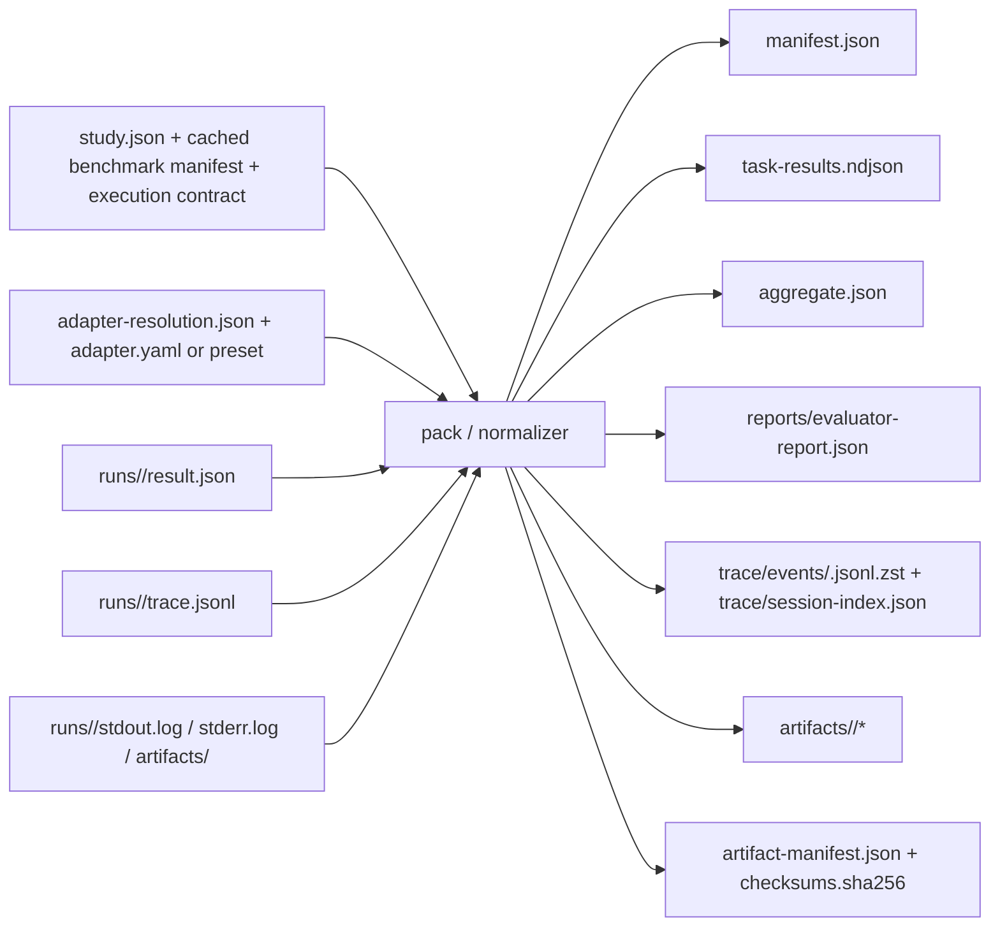

# Repair Packet C — Bundle / CLI Contract Convergence

> 作用范围：IR-09 / IR-10 / IR-19  
> 产出目标：为 draft2 提供一份可直接落到 schema / CLI / server intake 的 bundle / manifest / normalizer 收敛方案  
> 写入边界：仅本 repair packet；不在此文中改动主稿

---

## 1. 结论先说

本修复流的核心判断有 5 条：

1. **bundle 内部 layout 必须冻结为唯一规范，目录名本身不重要，内部路径才重要。**
2. **`manifest.json` 必须成为 runtime identity 的唯一规范入口。** `aggregate.json` 只放派生统计，`task-results.ndjson` 只放 task 级事实，`artifact-manifest.json` 只放文件清单。
3. **adapter 原始输出不是最终 bundle。** `run` 负责产出原始执行目录，`pack` / normalizer 负责把它归一化成最终 bundle。
4. **M2 / M3 / M5 / M6 的闭环应围绕一组固定 identity fields 收敛，而不是在各模块里各写一套近义字段。**
5. **命名统一原则：final bundle 统一使用 kebab-case 文件名；逻辑对象统一使用 `task_package` / `execution_contract` / `adapter_resolution_digest` 这一组 canonical 名称。**

---

## 2. 收敛决议（Normative Repair Decisions）

### C-1. 唯一 bundle 根目录规则

- `bundle` 根目录名 **不进入协议语义**；可以是本地目录、zip 根、对象存储前缀。
- 协议只约束 **bundle 根目录内部路径**。
- final bundle 中，**多词文件名统一使用 kebab-case**。
- raw run workspace 可以继续使用工程实现友好的临时命名，但 `pack` 输出后必须统一成 canonical layout。

### C-2. `manifest.json` 是 runtime identity 单一真源

final bundle 的关键身份字段，不再分散在：
- M2 的 prose
- M5 的 preset / adapter 解析结果
- M6 的统计字段示例

而是统一以 **`manifest.json` 的 canonical paths** 为准；M6 只引用逻辑字段名及其 canonical path，不再重新发明另一套根字段。

### C-3. raw adapter output 与 final bundle 分层

建议明确分成两层：

1. **raw run workspace（M5 / run 阶段）**
   - 面向执行与调试
   - 保存 adapter 原始输出
   - 允许实现细节存在

2. **final run bundle（M3 / pack 阶段）**
   - 面向上传、复算、复验、平台 intake
   - 只保留 canonical layout
   - 所有 refs 必须指向 bundle 内 canonical path 或显式外链对象

### C-4. attempt 语义收敛

为避免 M3 与 M5 的粒度歧义，建议 draft2 明确：

- `attempt_id`：**一个 run-group 成员的一次完整 run**，覆盖该次 run 中的全部 tasks
- adapter 在实现层若按单 task 调用执行，应该使用 `task execution unit` / `task-run` 这类术语描述，**不要把每个 task 调用也叫 attempt**
- final bundle 仍保持：**一个 bundle 对应一个 `attempt_id`**

---

## 3. 唯一 bundle 根目录 layout（MUST / MAY）

> 说明：下表定义的是 **final bundle** 的 canonical layout，不是 raw run workspace。

| Path | 级别 | 生产阶段 | 说明 |
|---|---|---|---|
| `manifest.json` | MUST | `pack` | bundle 的规范入口；冻结 runtime identity、benchmark / contract / policy / runtime 摘要 |
| `aggregate.json` | MUST | `pack` | 由 `task-results.ndjson` 与 evaluator 结果派生出的 attempt 级汇总 |
| `task-results.ndjson` | MUST | `pack` | task 级事实表；final bundle 的主事实文件 |
| `artifact-manifest.json` | MUST | `pack` | bundle 内文件清单、摘要、大小、媒体类型 |
| `checksums.sha256` | MUST | `pack` | 对 canonical bundle 文件的文件级摘要清单 |
| `reports/evaluator-report.json` | MUST | `run` → `pack` | evaluator 的规范输出位置；server replay 也以此为主入口 |
| `trace/session-index.json` | MUST | `pack` | raw trace 到 canonical trace 的索引；记录 task ↔ trace path / event count / source map |
| `trace/events/` | MUST (dir) | `pack` | canonical trace 目录 |
| `trace/events/<task_id>.jsonl.zst` | MUST* | `pack` | 每个已观测 task 至少 1 个 canonical trace 文件；`*` 表示“对 bundle 中出现的 task” |
| `artifacts/` | MUST (dir) | `pack` | canonical artifact 根目录 |
| `artifacts/<task_id>/` | MUST* | `pack` | 每个 task 的 artifacts 容器，至少容纳 stdout / stderr / final output / patch / screenshot 等 |
| `payloads/` | MAY | `pack` | 大对象正文，如 prompt / completion / HAR / transcript 分片 |
| `reports/tasks/` | MAY | `run` → `pack` | 任务级 evaluator 明细；如无独立任务级文件，可由 `evaluator-report.json` 内联承载 |
| `redactions.json` | MAY | `pack` | 脱敏规则与范围 |
| `attestation.json` | MAY | `run` / platform | 执行证明或受控环境证明 |

### 3.1 需要明确排除的非 canonical 命名

以下命名在 final bundle 中应视为 **deprecated / not canonical**：

- `task_results.ndjson` → 统一为 `task-results.ndjson`
- `bundle_manifest.json` → 统一为 `artifact-manifest.json`
- `task_manifest_hash`（放在 benchmark 组内）→ 统一为 `task_package.digest`
- `stdout.txt` / `stderr.txt` → 统一为 `stdout.log` / `stderr.log`

---

## 4. `manifest.json` 应冻结的 canonical runtime identity fields

> 原则：不新增第二套“平行字段”；直接冻结 canonical path。M6 的逻辑字段应映射到以下路径。

| 逻辑字段 | Canonical path in `manifest.json` | 级别 | 来源模块 / 对象 | 用途 |
|---|---|---|---|---|
| `benchmark_id` | `benchmark.id` | MUST | M2 / Benchmark Card | leaderboard slice 主键 |
| `benchmark_version` | `benchmark.version` | MUST | M2 / Benchmark Card | leaderboard slice 主键 |
| `split` | `benchmark.split` | MUST | M2 / Task Package / lane | 可比性与公开性过滤 |
| `lane_id` | `benchmark.lane_id` | MUST | M2 / Lane | slice / lane 过滤 |
| `task_package_digest` | `task_package.digest` | MUST | M2 / Task Package | 可比性最小条件 |
| `execution_contract_id` | `execution_contract.id` | MUST | M2 / Execution Contract | 引用合约对象 |
| `execution_contract_version` | `execution_contract.version` | SHOULD | M2 / Execution Contract | 调试与升级追踪 |
| `execution_contract_digest` | `execution_contract.digest` | MUST | M2 / Execution Contract | 可比性最小条件 |
| `evaluator_digest` | `evaluator.digest` | MUST | M2 / evaluator binding | replay / reproduce / score 复算 |
| `runner_digest` | `runtime.runner_digest` | MUST | M5 / CLI runtime | 运行器身份 |
| `adapter_digest` | `runtime.adapter_digest` | MUST | M5 / preset / custom adapter | harness 接入层身份 |
| `adapter_resolution_digest` | `runtime.adapter_resolution_digest` | MUST | M5 / resolver output | preset/custom adapter 解析后的最终身份 |
| `preset_id` | `runtime.preset_id` | SHOULD | M5 / preset resolver | 便于产品展示；不可替代 `adapter_resolution_digest` |
| `launcher_digest` | `runtime.launcher_digest` | SHOULD | M5 / launcher definition | 还原执行入口 |
| `harness_name` | `harness.name` | MUST | M3 / harness metadata | fixed-harness slice |
| `harness_version` | `harness.version` | SHOULD | M3 / harness metadata | 版本分组 |
| `harness_commit` | `harness.commit` | SHOULD | M3 / harness metadata | 源码快照 |
| `prompt_hash` | `harness.prompt_hash` | MUST | M3 / harness metadata | runtime identity |
| `rules_hash` | `harness.rules_hash` | SHOULD | M3 / harness metadata | runtime identity |
| `memory_config_hash` | `harness.memory_config_hash` | SHOULD | M3 / harness metadata | runtime identity |
| `tool_manifest_hash` | `harness.tool_manifest_hash` | SHOULD | M3 / harness metadata | 工具快照 |
| `model_provider` | `model.provider` | MUST | M3 / model metadata | fixed-model slice |
| `model_name` | `model.name` | MUST | M3 / model metadata | fixed-model slice |
| `model_snapshot` | `model.snapshot` | SHOULD | M3 / model metadata | 稳定比较 |
| `budget_policy_id` | `policy.budget_policy_id` | MUST | M2 / budget policy | M6 效率 / apples-to-apples 过滤 |
| `tool_policy_id` | `policy.tool_policy_id` | MUST | M2 / tool policy | M6 apples-to-apples 过滤 |
| `timeout_policy_id` | `policy.timeout_policy_id` | SHOULD | M2 / timeout / budget policy | repeated-run 与 timeout 比较 |
| `seed` | `policy.seed` | MUST | M2 / seed policy + M5 run | run-group 成员定位 |
| `human_assistance` | `policy.human_assistance` | MUST | M2 / assistance policy | trust / ranking / slice 过滤 |
| `benchmark_tuned` | `policy.benchmark_tuned` | MUST | M3 / policy declaration | 主榜过滤 |
| `cache_policy` | `policy.cache_policy` | SHOULD | M2 / cache policy | apples-to-apples 解释 |
| `persistent_memory_enabled` | `policy.persistent_memory_enabled` | SHOULD | M2 / memory policy | apples-to-apples 解释 |

### 4.1 结构建议

为减少 draft2 改动幅度，建议保留 M3 现有大组结构，但新增并冻结以下对象：

- `benchmark.lane_id`
- 顶层 `task_package` 对象
- 顶层 `execution_contract` 对象
- 顶层 `runtime` 对象
- `policy.budget_policy_id`
- `policy.timeout_policy_id`

### 4.2 明确不要再混用的字段

- 不要再用 `benchmark.task_manifest_hash` 指代 task package 身份
- 不要让 `preset_id` 代替 `adapter_resolution_digest`
- 不要只在 M6 prose 中写 `runner_digest` / `tool_policy_id`，却不给出 manifest canonical path

---

## 5. adapter intermediate output → normalizer → final bundle 映射

### 5.1 建议的两层目录语义

```text
.hb/
  study.json
  cache/
  runs/
    run_<id>/
      run-metadata.json
      adapter-resolution.json
      tasks/
        <task_id>/
          result.json
          trace.jsonl
          stdout.log
          stderr.log
          artifacts/
  bundles/
    <bundle_id>/
      ...canonical final bundle...
```

其中：
- `run-metadata.json`：CLI 在 `run` 阶段生成，记录 `study.json`、环境快照、模型参数、seed、policy ids 等
- `adapter-resolution.json`：CLI resolver 生成，记录 preset / custom adapter 解析结果与 digest
- adapter 本身只负责写 task 级原始事实；**final bundle 由 `pack` 统一生成**

### 5.2 映射图



### 5.3 映射表

| Raw source | Normalizer action | Final bundle path | 说明 |
|---|---|---|---|
| `study.json` | 读取 study / run-group / lane / seed / mode 上下文 | `manifest.json` | study 是运行上下文输入，不直接原样进入 final bundle |
| cached benchmark manifest | 提取 benchmark / lane / task package / evaluator 关键信息 | `manifest.json` | 只固化必要 identity fields 与 digests |
| cached execution contract | 提取 contract / budget / tool / timeout policy ids | `manifest.json` | 不建议把完整 contract 再复制进 bundle 根 |
| `adapter.yaml` / preset 配置 | 经 resolver 归一化后计算 digest | `manifest.json` (`runtime.*`) | final bundle 记录 digest 与 resolution 结果，不把原始工程配置当 canonical 事实 |
| `adapter-resolution.json` | 作为 runtime identity 输入 | `manifest.json` (`runtime.adapter_digest` / `runtime.adapter_resolution_digest` / `runtime.preset_id`) | 解决 preset 与 custom adapter 收敛问题 |
| `tasks/<task_id>/result.json` | 规范化 task status / cost / latency / refs | `task-results.ndjson` | raw `result.json` 不是 final schema |
| 全部 task rows | 聚合统计 | `aggregate.json` | `aggregate.json` 必须可由 task results + evaluator report 复算 |
| `tasks/<task_id>/trace.jsonl` | 压缩、按 task 放入 canonical trace 路径；生成 session index | `trace/events/<task_id>.jsonl.zst` + `trace/session-index.json` | 解决 raw trace 与 final trace 路径不一致问题 |
| `tasks/<task_id>/stdout.log` | 原样搬运并登记 refs | `artifacts/<task_id>/stdout.log` | 统一后缀为 `.log` |
| `tasks/<task_id>/stderr.log` | 原样搬运并登记 refs | `artifacts/<task_id>/stderr.log` | 统一后缀为 `.log` |
| `tasks/<task_id>/artifacts/*` | 归入 task artifact 容器并登记 digest | `artifacts/<task_id>/*` | screenshot / patch / final output / HAR 等 |
| local evaluator output | 归一化为 canonical 报告路径 | `reports/evaluator-report.json` | server replay 以该路径为主入口 |
| final bundle 全部 canonical files | 生成文件清单与摘要 | `artifact-manifest.json` + `checksums.sha256` | server intake / replay / reproduce 均依赖 |

---

## 6. M2 / M3 / M5 / M6 之间字段闭环建议

### 6.1 闭环总原则

- **M2 定义对象与 policy 身份**
- **M5 在 `init` / `run` 阶段拿到这些对象，并写入 raw run metadata**
- **M3 在 `pack` 阶段把 raw run metadata + adapter 原始结果归一化进 final bundle**
- **M6 只消费 canonical paths，不再额外发明字段名**

### 6.2 字段闭环矩阵

| 逻辑字段 | 权威来源 | 产生阶段 | Final bundle 落点 | 主要消费者 |
|---|---|---|---|---|
| `lane_id` | M2 / Lane | `init` | `manifest.benchmark.lane_id` | M6 slice / UI filter |
| `task_package_digest` | M2 / Task Package | `init` | `manifest.task_package.digest` | M6 apples-to-apples / reproduce |
| `execution_contract_digest` | M2 / Execution Contract | `init` | `manifest.execution_contract.digest` | M6 apples-to-apples / reproduce |
| `budget_policy_id` | M2 / budget policy | `init` | `manifest.policy.budget_policy_id` | M6 efficiency / comparison filter |
| `tool_policy_id` | M2 / tool policy | `init` | `manifest.policy.tool_policy_id` | M6 comparison filter |
| `timeout_policy_id` | M2 / timeout / budget policy | `init` | `manifest.policy.timeout_policy_id` | M6 timeout / reliability filter |
| `adapter_digest` | M5 / adapter contract | `run` resolver | `manifest.runtime.adapter_digest` | M6 harness identity / reproduce |
| `adapter_resolution_digest` | M5 / preset/custom adapter resolution | `run` resolver | `manifest.runtime.adapter_resolution_digest` | exact runtime identity |
| `preset_id` | M5 / preset resolver | `run` resolver | `manifest.runtime.preset_id` | UI 展示 / onboarding 说明 |
| `runner_digest` | M5 / CLI runtime | `run` | `manifest.runtime.runner_digest` | replay / reproduce / server intake |
| task `status` / `cost_usd` / `wall_clock_sec` | M5 raw adapter output | `run` → `pack` | `task-results.ndjson` | M6 effectiveness / efficiency / reliability |
| attempt-level aggregate metrics | M6 定义口径 | `pack` | `aggregate.json` | UI / ranking / replay diff |
| file digests / media types | M3 / pack | `pack` | `artifact-manifest.json` | replay / audit / server intake |

### 6.3 对 M6 的约束建议

draft2 中，M6 应把“逻辑字段名”与“canonical bundle path”对齐，例如：

- `task_package_digest` = `manifest.task_package.digest`
- `execution_contract_digest` = `manifest.execution_contract.digest`
- `runner_digest` = `manifest.runtime.runner_digest`
- `tool_policy_id` = `manifest.policy.tool_policy_id`

不要在 M6 中继续使用没有 canonical path 的“自由浮动字段名”。

---

## 7. 需要统一的命名，以及统一结果

### 7.1 文件 / 目录命名

| 当前冲突 | 统一结果 | 备注 |
|---|---|---|
| `task-results.ndjson` vs `task_results.ndjson` | `task-results.ndjson` | final bundle 一律 kebab-case |
| `artifact-manifest.json` vs `bundle_manifest.json` | `artifact-manifest.json` | `bundle_manifest.json` 废弃 |
| `stdout.txt` vs `stdout.log` | `stdout.log` | raw / final 一致 |
| `stderr.txt` vs `stderr.log` | `stderr.log` | raw / final 一致 |
| `trace.jsonl`（raw） vs final trace 无唯一位置 | raw 保持 `trace.jsonl`；final 统一为 `trace/events/<task_id>.jsonl.zst` | raw 与 final 分层 |
| `run_bundle/` 这种目录名示例 | 使用 `<bundle-root>/` 占位 | 根目录名不进入协议语义 |

### 7.2 对象 / 字段命名

| 当前冲突或歧义 | 统一结果 | 备注 |
|---|---|---|
| `task_manifest_hash` | `task_package.digest` | task package 是独立对象，不挂在 benchmark 下冒充 manifest hash |
| `preset` 身份 vs adapter 身份混用 | `runtime.preset_id` + `runtime.adapter_resolution_digest` | `preset_id` 只作展示，identity 以 resolution digest 为准 |
| `adapter digest` 无固定挂点 | `runtime.adapter_digest` | final manifest 固定路径 |
| `budget_policy`（对象） vs `budget_policy_id`（筛选键） | M2 保留对象，M3/M6 固定使用 `policy.budget_policy_id` | 便于 slice / filter |
| `tool_policy`（对象） vs `tool_policy_id`（筛选键） | M2 保留对象，M3/M6 固定使用 `policy.tool_policy_id` | 同上 |
| `attempt` 既指 run 又指 task 调用 | `attempt_id` 只指完整 run；task 粒度用 `task execution unit` / `task-run` | 消除 M3/M5 歧义 |

---

## 8. 建议改动到哪些模块、哪些段落

### 8.1 `ohbp-v0.1-draft1.md`

建议改动段落：

- **§5.2 Run Data & Evidence 层**：把 bundle 文件列表改成 canonical layout
- **§6 CLI-first 执行层**：补一句“raw run workspace ≠ final bundle；final bundle 由 `pack` 归一化生成”
- **§6.2 Custom Adapter 最小合同**：补充 adapter 原始输出与 final bundle 的分层说明

### 8.2 `modules/run-data-evidence.md`（M3）

建议改动段落：

- **§4 Run Manifest**：新增 `benchmark.lane_id`、`task_package.*`、`execution_contract.*`、`runtime.*`、`policy.budget_policy_id`、`policy.timeout_policy_id`
- **§6 Task-level Results**：保留并冻结 `task-results.ndjson` 文件名
- **§8 Bundle Layout**：替换为本 repair packet 的唯一 layout；明确 MUST / MAY
- **§9 证据哈希与完整性建议**：把 `artifact-manifest.json` / `checksums.sha256` 的规范地位写硬
- **§11 v0.1 最小必选项**：与新的 MUST 文件列表对齐

### 8.3 `modules/cli-adapter.md`（M5）

建议改动段落：

- **§2.3 生命周期状态**：明确 raw run workspace 与 final bundle 的分层
- **§4.3 `run`**：要求 `run` 产出 `run-metadata.json` 与 `adapter-resolution.json`
- **§4.4 `pack`**：把 deterministic normalizer 行为写成 canonical 过程
- **§5.3 Custom Adapter 最小合同**：保留 `result.json` / `trace.jsonl` / `stdout.log` / `stderr.log` 作为 raw output；不要再把它们误写成 final bundle 结构
- **§5.4 Adapter 执行粒度**：把“一个 adapter 调用处理一个 task × seed × attempt”改写为“一个 adapter 调用处理一个 task execution unit；CLI 汇总为一个 `attempt_id` bundle”
- **§6.2 本地目录建议**：引入 `run-metadata.json`、`adapter-resolution.json`、`tasks/<task_id>/...` 的 raw layout 示例
- **§6.3 打包行为要求**：加入 raw→canonical 的映射要求

### 8.4 `modules/benchmark-execution.md`（M2）

建议改动段落：

- **§6.2 Execution Contract 的最低字段**：明确 `budget_policy_id`、`tool_policy_id`、`timeout_policy_id` 是需要被 downstream bundle 引用的 canonical ids
- **§10 交接给其他模块的接口**：把 `task_package_digest`、`execution_contract_digest`、`budget_policy_id`、`tool_policy_id`、`timeout_policy_id` 明确列为向 M3/M5/M6 的稳定输出

### 8.5 `modules/metrics-uncertainty.md`（M6）

建议改动段落：

- **§5.2 Run group 最小约束**：引用 canonical manifest paths，不再只写逻辑字段名
- **§7 Model vs Harness 分离**：比较约束中的字段应统一映射到 `manifest.json` canonical paths
- **§11 本模块要求其他模块承载的最小字段**：改成“逻辑字段名 + canonical path”对照表

---

## 9. 依赖与边界说明

本 repair packet **不直接定义**：

- run-group preregistration / completeness proof 对象（IR-02）
- reproduction / verification tolerance policy 对象（IR-03 / IR-05）

但建议 draft2 在不冲突前提下为后续修复预留 canonical 挂点，例如：

- `manifest.registration_ref`
- `manifest.policy.tolerance_policy_ref`

以上字段在本修复流中**仅作预留建议，不在此文中定 schema**。

---

## 10. 一句话结论

**IR-09 / IR-10 / IR-19 的收敛关键，不是再加更多对象，而是把“raw run workspace、adapter resolution、final bundle、统计消费”这四层明确拆开，并让 `manifest.json` 成为唯一 runtime identity 入口。**
