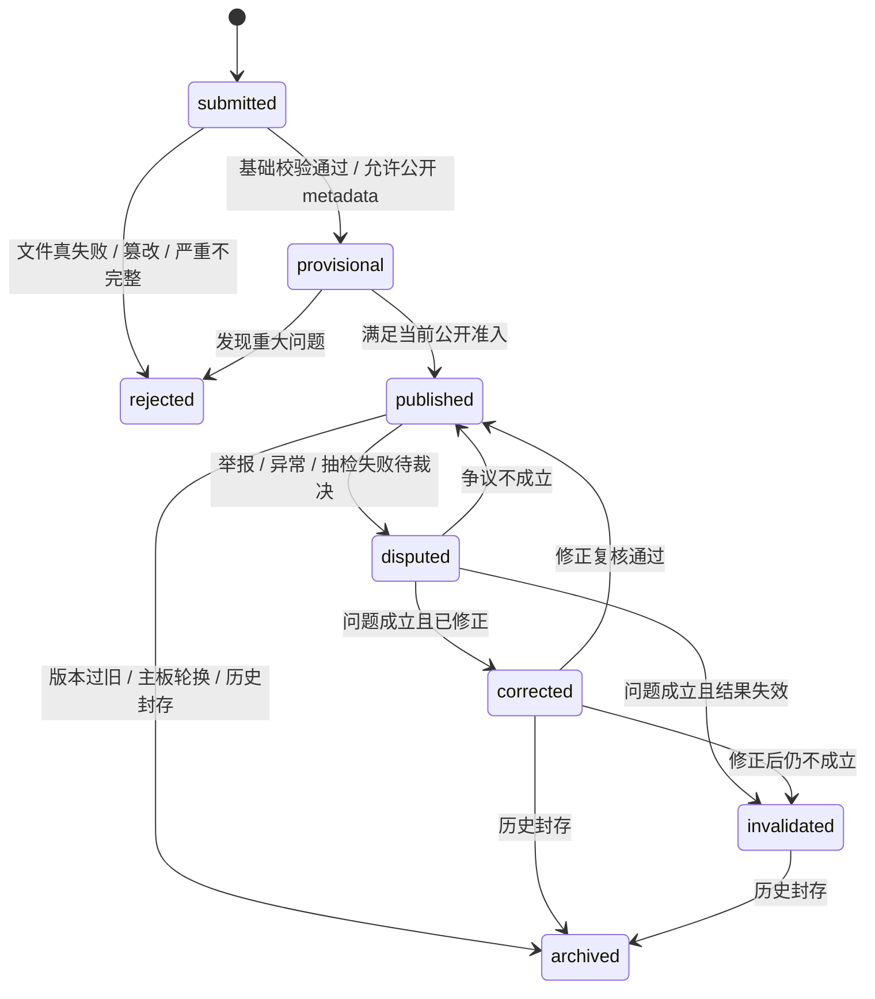

# OHBP v0.2 方法学与状态机

## 0. 这份文档是干什么的

这不是“讲概念”的文档，而是一份**可以直接指导下一批代码改造**的 v0.2 方法学说明。

它回答 4 个问题：

1. OHBP 的真榜在 v0.2 到底怎么定义；
2. 单人、低预算条件下，真实性靠什么守住；
3. `publication_state` 应该怎么从枚举变成真正运行的状态机；
4. 下一批代码应该先改哪里。

---

## 1. v0.2 的一句话目标

> **v0.2 不追求“更花哨的分数”，而追求“更真实的证据边界 + 更明确的状态语义 + 更低成本可执行的真榜规则”。**

也就是说，v0.2 的重点不是把 consumer 页面做成更像真榜，而是把 Evidence / Board / Entry / Verifier 这一层做得更像真榜。

---

## 2. v0.2 的范围边界

## 2.1 明确保留不动的部分

以下内容在 v0.2 继续允许保持现状：

- consumer 首页导购
- host leaderboard 导购
- compare 维度热力图
- `curated_host_fit_demo` 这套静态导购逻辑

原因：

- 这层本来就是导购层，不是真榜层；
- 用户当前最需要先把 Evidence 层的语义收紧，而不是把 consumer 层“伪装得更权威”。

---

## 2.2 v0.2 要收紧的部分

v0.2 重点收紧 4 个地方：

1. **Evidence 层禁止 runtime demo fallback 混入真实证据面**
2. **Official / Frontier / Community 三层准入语义更明确**
3. **`publication_state` 从静态枚举升级为真正状态机**
4. **排序先回到 fixed slice + success-first + uncertainty-aware**

---

## 3. v0.2 的核心原则

## 原则 1：consumer 与 evidence 继续分层

consumer 可以继续回答：

- “我先试哪个 harness？”
- “Codex / Claude Code / OpenCode 下谁更适合？”

evidence 必须回答：

- “这条成绩有没有真实公开证据？”
- “它为什么能上 Official / Frontier / Community？”
- “如果不能上，它到底缺什么？”

---

## 原则 2：真榜不先做神秘总分

v0.2 不引入全局黑盒总分。

主排序规则保持简单：

1. 在 **固定 slice** 内比较；
2. 先看 `objective_success_rate`；
3. 再看 repeated-run / uncertainty；
4. 差距不显著时，不硬排名次，改给同 tier；
5. `cost / latency` 只做稳定显示顺序的 tie-break。

---

## 原则 3：真实性不用“真实性总分”，而用“六道闸门”

v0.2 的真实性判断不做 `trust_score = 87` 这种黑盒分数。

改用六道闸门：

1. **文件真**：bundle / digest / checksum / manifest 对得上
2. **次数真**：run-group 完整，不能只传最好一次
3. **人工真**：autonomy / approval / interactive 与 trace 一致
4. **环境真**：execution contract 固定
5. **泛化真**：benchmark-tuned、hidden split、sealed evidence 声明清楚
6. **稳定真**：runs 足够，uncertainty 可展示

这六道闸门决定能不能进哪一层，不决定一个“漂亮单分”。

---

## 4. v0.2 的最小 slice 定义

v0.2 中，一个可以公开比较的最小 slice，至少固定以下字段：

- `benchmark_id`
- `benchmark_version`
- `lane_id`
- `comparison_mode`
- `execution_contract_digest`
- `tolerance_policy_digest`
- `repeatability_class`
- `autonomy_mode`
- `benchmark_tuned_flag`

如果是 `fixed_model_compare_harness`，还需要固定：

- `model.id`

如果是 `fixed_harness_compare_model`，还需要固定：

- `harness.id`

---

## 5. v0.2 的官方排序规则

## 5.1 排序对象

只在**同一个 fixed slice** 内排序。

不允许：

- 把不同 benchmark version 混成一张总榜
- 把不同 execution contract 混成一张表
- 把不同 trust tier 混成“一个总排名”

---

## 5.2 主排序

主排序指标：

- `objective_success_rate`

原因：

- 这是最接近普通用户真实问题的指标：任务到底成没成。

---

## 5.3 次排序

只有在 success 非常接近时，才使用：

1. `median_cost_usd`
2. `p95_latency_ms`

但要明确：

- 这只是显示顺序稳定器；
- 不能把它解释成“能力明显更强”。

---

## 5.4 排名输出形态

v0.2 推荐三种公开形态：

### A. `warming_up`

- 样本还太少
- 先公开空态与方法说明

### B. `comparison_only`

- 只有 2 个 eligible entries
- 只做 head-to-head，不做权威 ordinal rank

### C. `ranked_tiered`

- 样本足够比较
- 但仍优先用 tier / cluster 展示

**v0.2 暂不强求进入 `ranked_ordinal`。**

如果后面要给 `ranked_ordinal`，必须再补：

- repeated-run
- uncertainty strip
- rank spread / paired delta

---

## 6. v0.2 的三层板定义

## 6.1 Community Lab

适用语义：

- 允许公开显示 digest / metadata
- 允许较低门槛的公开样本
- 不假装成官方结论

推荐最低门槛：

- 通过文件真
- 有最小 run-group 信息
- 能构建出 entry 详情页

---

## 6.2 Reproducibility Frontier

适用语义：

- 已经接近官方可信层
- 重点展示“还差什么”

推荐最低门槛：

- run-group 比较完整
- 至少 3 runs
- evidence 足够完整
- interactive 风险不能过高

---

## 6.3 Official Verified

适用语义：

- 默认公开结论层
- 可供外部引用的高信任板

推荐最低门槛：

- 六道闸门全部通过
- `publication_state = published`
- `trust_tier = verified`
- 无 unresolved dispute
- 有一次平台抽样复跑、hidden 检查或同等强度复核

---

## 7. v0.2 的 publication state 状态机

## 7.1 为什么要升级状态机

当前代码里：

- `packages/types/src/enums.ts` 已经定义了完整枚举
- 但 `packages/verifier-core/src/verification.ts` 里的 `derivePublicationState()` 只真正走到了：
  - `submitted`
  - `provisional`
  - `published`

也就是说：

- 协议枚举已经更成熟
- 运行时状态机还没有真正接上

v0.2 要解决的，就是这个“枚举先行、运行滞后”的问题。

---

## 7.2 推荐状态定义

| 状态 | 含义 | 是否可公开 | 是否可进 Official |
| --- | --- | --- | --- |
| `submitted` | 已接收，但还没达到公开准入 | 可选，仅 metadata | 否 |
| `provisional` | 基本完整，但还缺高信任条件 | 可以 | 否 |
| `published` | 已满足当前公开发布条件 | 可以 | 视 trust / admission 而定 |
| `disputed` | 被举报或发现异常，等待裁决 | 可以，但要打警示 | 否 |
| `corrected` | 曾有问题，已更正并重新发布 | 可以 | 重新判定 |
| `invalidated` | 结果失效，不再可作为比较依据 | 可以保留历史页 | 否 |
| `rejected` | 上传被拒绝，不进入公开面 | 否 | 否 |
| `archived` | 历史归档，不再参与当前榜单 | 可历史查看 | 否 |

---

## 7.3 推荐状态迁移

---

## 7.4 各状态的榜单行为

### `submitted`

- 不进 Official / Frontier
- Community 可只显示极简 metadata，或者完全不显示

### `provisional`

- 可进入 Community
- 满足条件时可进入 Frontier
- 不进 Official

### `published`

- 才允许进入公开比较面
- 但仍要看 board admission 和 trust tier

### `disputed`

- 从 Official / Frontier 自动下架
- 详情页保留
- 必须显示 dispute 标识与原因

### `corrected`

- 重新走 admission
- 历史中要能看到修正前后差异

### `invalidated`

- 不再参与任何活跃榜单
- 详情页保留“为何失效”

### `rejected`

- 不进入公开站点

### `archived`

- 只保留历史页与历史解释
- 不参与当前排名

---

## 8. v0.2 的低成本真实性流程

## 8.1 上传前

对于非 Community 的提交，建议至少先登记：

- `study_id`
- `run_group_id`
- 计划 attempt 数
- `requested_trust_tier`
- `benchmark / lane / execution_contract_digest`

---

## 8.2 上传时

平台只相信 bundle truth，不直接相信客户端自报。

至少要有：

- `manifest`
- `public_bundle_digest`
- task-level results
- interaction / trace 摘要
- execution contract 绑定信息

高信任层再加：

- `sealed_audit_bundle_digest`

---

## 8.3 上传后

平台自动做 3 类事：

1. **复算**
   - digest
   - aggregate metrics
   - attempt 完整性
2. **准入判断**
   - Community / Frontier / Official 分层
3. **抽样复跑**
   - 只打到最值钱的条目

---

## 8.4 复跑优先级

单人低预算下，只优先打这三类：

1. 冲榜条目
2. Top 条目
3. 被举报 / 异常条目

这比“全量复跑所有条目”更现实，也更有效。

---

## 9. v0.2 的当前代码差距

下面是当前代码与 v0.2 目标的主要差距。

## 9.1 `apps/web/src/data.ts`

当前问题：

- 没有快照时，会补 synthetic demo entries
- 会把 Evidence 层的真数据边界冲淡

v0.2 目标：

- **Evidence 层禁止 demo fallback**
- 没数据就显示空态 / `warming_up`

---

## 9.2 `packages/view-models/src/boards.ts`

当前问题：

- 排序还是 success + cost + latency
- 但还没有 uncertainty / significance / rank band

v0.2 目标：

- 继续 success-first
- 暂时优先 `ranked_tiered`
- 后续再加 repeated-run / CI / paired delta

---

## 9.3 `packages/verifier-core/src/verification.ts`

当前问题：

- `derivePublicationState()` 只支持前三个状态
- dispute / corrected / invalidated 还没进入运行时

v0.2 目标：

- 至少补上争议、修正、失效的运行时迁移入口

---

## 9.4 `packages/view-models/src/entries.ts`

当前问题：

- 详情页会显示 `publication_state`
- 但还没有真正的 dispute / corrected / invalidated 叙事结构

v0.2 目标：

- 详情页可以解释：
  - 为什么被争议
  - 为什么被修正
  - 为什么失效

---

## 10. v0.2 的第一批代码改造顺序

## P0：立刻做

### 1) 禁用 Evidence 层 demo fallback

目标文件：

- `E:/工作区/10_Projects_项目/harness测评网站/apps/web/src/data.ts`

预期结果：

- Board / Entry / Home 的 Evidence 面只读真实公开 publication
- 没数据时显示空态，不再补 synthetic entries

### 2) 补空态 UI

目标文件：

- `E:/工作区/10_Projects_项目/harness测评网站/apps/web/src/render.ts`

预期结果：

- 没数据时页面不空白
- 明确告诉用户当前是 warming_up / insufficient_evidence

---

## P1：下一步做

### 3) 把 publication state 真正接上运行时

目标文件：

- `packages/verifier-core/src/verification.ts`
- `packages/view-models/src/entries.ts`
- `packages/view-models/src/boards.ts`

预期结果：

- `disputed / corrected / invalidated / archived` 不再只是枚举摆设

### 4) 增加 dispute / correction history

目标文件：

- `packages/verifier-core/src/types.ts`
- `packages/view-models/src/entries.ts`

预期结果：

- 详情页能解释状态变化

---

## P2：预算允许后做

### 5) 增加 uncertainty 字段

例如：

- CI
- rank spread
- paired delta
- repeated-run 展示

### 6) 增加抽样复跑结果字段

例如：

- `rerun_status`
- `rerun_batch_id`
- `platform_rerun_digest`

---

## 11. v0.2 的最小验收标准

如果满足以下条件，就可以认为 v0.2 的第一阶段是成立的：

1. Evidence 层不再自动补 synthetic demo entries；
2. 没数据时会明确显示 `warming_up` / 空态；
3. 排名仍限定在 fixed slice 内；
4. `publication_state` 的扩展状态已经写入方法学，并开始进入代码改造计划；
5. 用户能看懂：
   - 这条结果现在在哪一层；
   - 为什么能上；
   - 为什么不能上。

---

## 12. 一句话结论

> **v0.2 的正确方向不是“做一个更复杂的榜单”，而是“先让榜单不说假话，再让状态会说人话，最后才去补统计花活”。**
